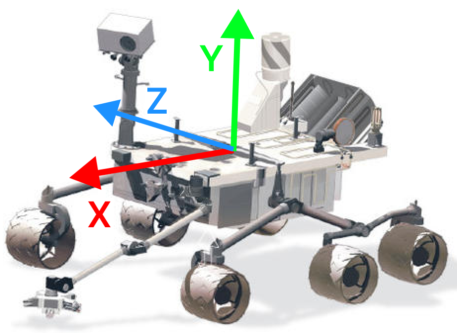

# Level 2: Package Creation and Topics

Welcome to Level 2! In this level, you'll create a ROS package to control a virtual rover using a simple publisher-subscriber communication pattern. This will help you understand the core communication mechanisms in ROS, which are essential for building modular and scalable robotic applications.

## Objectives

- Create a package inside the Docker image
- Create a simple publisher-subscriber system

### Approximate Time: 1h30

## Scenario: Controlling the Rover

Imagine you are tasked with developing the command system for our rover. Your job is to create a control interface that sends movement commands to the rover, and a system that interprets these commands to move the rover accordingly.

You will create a publisher that sends `Twist` messages (a translation and rotation vector, see [doc](https://docs.ros.org/en/noetic/api/geometry_msgs/html/msg/Twist.html)) based on user input, and a subscriber that receives these messages and interprets them as movement commands.

### Commands

The publisher will send a `Twist` message, which the subscriber will interpret as a trajectory command. The user will input letters to indicate the trajectory to send:

- `w`: Move Forward (+x)
- `a`: Slide Left (-z)
- `s`: Move Backward (-x)
- `d`: Slide Right (+z)
- `t`: Rotate Left (+ry)
- `y`: Rotate Right (-ry)



### Subscriber Interpretation

The subscriber will receive the data and transform it into a coherent string, filtering out impossible commands:

- `Tx axis`: “Go [Forward / Backward]”
- `Tx axis` and `Ry axis`: “Go [Left / Right]”
- `Tz axis`: “Slide [Left / Right]”
- `Ry axis`: “Rotating on itself to the [Left / Right]”
- `Tz axis` and `Ry axis`, `Tx axis` and `Tz axis`: “Forbidden move”

It will also print the position: “New Position: `[x, z, orientation (Ry)]`”, where translation is updated after rotation if both are present.

## Step-by-Step Instructions

### Step 1: Create a ROS Package

1. **Open the Docker container**:

   If the Docker container is not already running, start it using the `run.sh` script (for Mac or Linux) or `run.bat` (for Windows):

   ```sh
   ./run.sh (Mac or Linux)
   run.bat (Windows)
   ```

2. **Create a new ROS package**:

   Inside the Docker container, create a new workspace and a package:

   ```sh
   cd src
   ros2 pkg create --build-type ament_python rover_commands
   ```

   This command creates a new ROS package named `rover_commands` using Python. The `--build-type ament_python` specifies that we are using Python for this package.

3. **Navigate to the package directory**:
   ```sh
   cd rover_commands
   ```

### Step 2: Create the Publisher Node

1. **Open a Text Editor/IDE**:

   If it is not the case, open the assignement in your favorite text editor or IDE. We recommend VS Code for its ease of use and installation.

   Once this is done, you can edit the files directly on your computer, they will also be updated in real-time in Docker!

   You will see that in the assignement a new folder appeared, it is your package. It should have the following content:

   ```
   | rover_commands
   | -- | resource
   |    | -- | rover_commands
   | -- | rover_commands
   |    | -- | __init__.py
   | -- | test
   |    | -- | some files
   | -- | package.xml
   | -- | setup.cfg
   | -- | setup.py
   ```

2. **Create the publisher script**:

   Inside the folder rover_commands of the package, we will place all the source code of our package. Create a file named `publisher.py` in your editor.

   Check that it also appears in Docker using:

   ```sh
   cd ~/dev_ws/src/rover_commands/rover_commands
   ls
   ```

3. **Edit the publisher script**:

   Open `publisher.py` with a text editor and add the following code:

   ```python
   import rclpy
   from rclpy.node import Node
   from geometry_msgs.msg import Twist

   class TrajectoryPublisher(Node):

       def __init__(self):
           super().__init__('trajectory_publisher')
           # TODO: Create a publisher of type Twist
           # Your code here


           self.get_logger().info('Publisher node has been started.')

           # TODO: Create a loop here to ask users a prompt and send messages accordingly


        # Function that prompts user for a direction input, and sends the command
        def cmd_acquisition(self):
           command = input("Enter command (w/a/s/d/t/y - max 2 characters): ")
           # TODO: Complete the function to transform the input into the right command.
           # Your code here
           pass

   def main(args=None):
       rclpy.init(args=args)   # Init ROS python
       node = TrajectoryPublisher()  # Create a Node instance
       rclpy.spin(node)  # Run the node in a Thread
       node.destroy_node()
       rclpy.shutdown()

   if __name__ == '__main__':
       main()
   ```

   This script defines a `TrajectoryPublisher` node that waits for user input and publishes a `Twist` message based on the command. The `cmd_acquisition` function is called indefinitely to prompt for user input.

   Now your turn to complete it! Use online resources such as [ROS doc](https://docs.ros.org/en/foxy/Tutorials/Beginner-Client-Libraries/Writing-A-Simple-Py-Publisher-And-Subscriber.html).

4. **Update the `setup.py`**:

   In the `rover_commands` directory, open the `setup.py` file and add the following entry to the `console_scripts` list:

   ```python
   entry_points={
       'console_scripts': [
           'publisher = rover_commands.publisher:main',
       ],
   },
   ```

   This tells ROS to register the `publisher` script as an executable node.

### Step 3: Create the Subscriber Node

1. **Create the subscriber script**:

   Again, inside the folder rover_commands of the package, create a file named `subscriber.py` in your editor.

   Check that it also appears in Docker using:

   ```sh
   cd ~/dev_ws/src/rover_commands/rover_commands
   ls
   ```

2. **Edit the subscriber script**:

   Open `subscriber.py` with a text editor and add the following code:

   ```python
   import rclpy
   from rclpy.node import Node
   from geometry_msgs.msg import Twist

   class TrajectorySubscriber(Node):

       def __init__(self):
           super().__init__('trajectory_subscriber')
           # TODO: Create a subscriber of type Twist, that calls listener_callback
           # Your code here

           self.get_logger().info('Subscriber node has been started.')
           self.position = {'x': 0.0, 'z': 0.0, 'ry': 0.0}

       def listener_callback(self, msg):
           # TODO: Interpret the received commands and log the result using self.get_logger().info()
           # Your code here

           self.get_logger().info(f'New Position: {self.position}')

   def main(args=None):
       rclpy.init(args=args)
       node = TrajectorySubscriber()
       rclpy.spin(node)
       node.destroy_node()
       rclpy.shutdown()

   if __name__ == '__main__':
       main()
   ```

   This script defines a `TrajectorySubscriber` node that listens for `Twist` messages on the `trajectory` topic. It interprets the commands and prints the corresponding action and updated position.

   Now your turn to complete it! Use online resources such as [ROS doc](https://docs.ros.org/en/foxy/Tutorials/Beginner-Client-Libraries/Writing-A-Simple-Py-Publisher-And-Subscriber.html).

3. **Update the `setup.py`**:

   In the `rover_commands` directory, open the `setup.py` file and add the following entry to the `console_scripts` list:

   ```python
   entry_points={
       'console_scripts': [
           'publisher = rover_commands.publisher:main',
           'subscriber = rover_commands.subscriber:main',
       ],
   },
   ```

   This tells ROS to register the `subscriber` script as an executable node.

### Step 4: Build and Run the Package

1. **Build the package**:

   In the `dev_ws` directory, build the package:

   ```sh
   cd ~/dev_ws/
   colcon build
   ```

   This command compiles the package and sets up the necessary environment.

2. **Source the setup file**:

   After building, source the setup file to overlay the workspace on your environment:

   ```sh
   . install/setup.bash
   ```

   This command sets up the environment variables needed to run the nodes. Now, your terminal is aware of the existing nodes. You will have to execute this command on every terminal you open to help it find your nodes.

3. **Run the publisher node**:

   In one terminal inside the Docker container, run the publisher node:

   ```sh
   ros2 run rover_commands publisher
   ```

   This starts the `TrajectoryPublisher` node, which waits for user input and publishes the corresponding `Twist` message.

4. **Run the subscriber node**:

   Open a new terminal inside the Docker container and run the subscriber node:

   ```sh
   docker exec -it base_humble_desktop bash
   . install/setup.bash
   ros2 run rover_commands subscriber
   ```

   This starts the `TrajectorySubscriber` node, which listens for `Twist` messages on the `trajectory` topic and prints the interpreted commands and updated position.

### Example Run

1. **Start the Publisher Node**:

   In the first terminal, you will be prompted to enter commands (e.g., `w`, `a`, `s`, `d`, `t`, `y`).

2. **Monitor the Subscriber Node**:

   In the second terminal, you will see the subscriber node interpreting the commands and printing the corresponding actions and updated position.

   Example Output:

   ```sh
   Enter command (w/a/s/d/t/y): w
   [INFO] [publisher]: Published: linear:
   x: 1.0
   y: 0.0
   z: 0.0
   angular:
   x: 0.0
   y: 0.0
   z: 0.0
   ---
   [INFO] [subscriber]: Go Forward
   [INFO] [subscriber]: New Position: {'x': 1.0, 'z': 0.0, 'ry': 0.0}
   ```

By completing these steps, you have created a ROS package with a simple publisher-subscriber system to control the rover. The publisher sends trajectory commands, and the subscriber interprets and prints the trajectory.

Congratulations on completing Level 2! You are now ready to move on to more complex interactions in [Level 3](./Level3.md).
