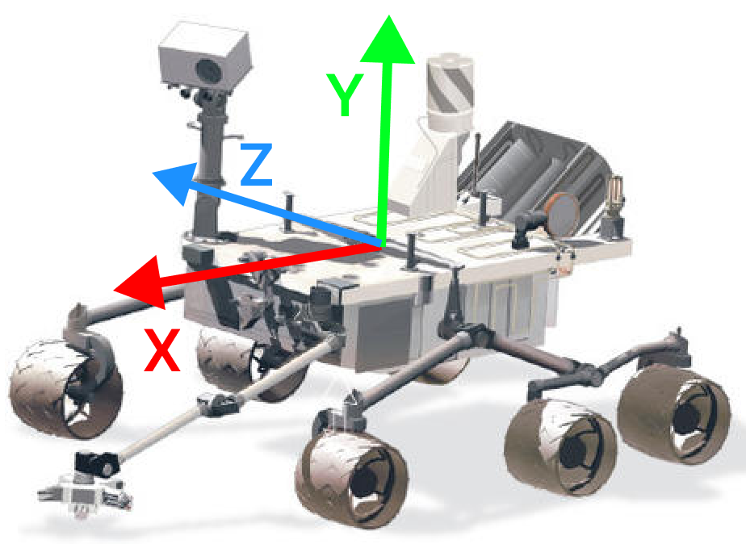

# Level 2: Package Creation and Topics - C++

Welcome to Level 2! In this level, you'll create a ROS package to control a virtual rover using a simple publisher-subscriber communication pattern.

This will help you understand the core communication mechanisms in ROS, which are essential for building modular and scalable robotic applications.

## Objectives

- Create a package inside the Docker image
- Create a simple publisher-subscriber system

### Approximate Time: 1h30

## Scenario: Controlling the Rover

Imagine you are tasked with developing the command system for our rover.

Your job is to create a control interface that sends movement commands to the rover, and a system that interprets these commands to move the rover accordingly.

You will create a publisher that sends `Twist` messages (a translation and rotation vector, see [doc](https://docs.ros.org/en/noetic/api/geometry_msgs/html/msg/Twist.html)) based on user input, and a subscriber that receives these messages and interprets them as movement commands.

### Commands

The publisher will send a `Twist` message, which the subscriber will interpret as a trajectory command. The user will input letters to indicate the trajectory to send:

- `w`: Move Forward (+x)
- `a`: Slide Left (-z)
- `s`: Move Backward (-x)
- `d`: Slide Right (+z)
- `t`: Rotate Left (+ry)
- `y`: Rotate Right (-ry)



### Subscriber Interpretation

The subscriber will receive the data and transform it into a coherent string, filtering out impossible commands:

- `Tx axis`: “Go [Forward / Backward]”
- `Tx axis` and `Ry axis`: “Go [Left / Right]”
- `Tz axis`: “Slide [Left / Right]”
- `Ry axis`: “Rotating on itself to the [Left / Right]”
- `Tz axis` and `Ry axis`, `Tx axis` and `Tz axis`: “Forbidden move”

It will also print the position: “New Position: `[x, z, orientation (Ry)]`”, where translation is updated after rotation if both are present.

## Step-by-Step Instructions

### Step 1: Create a ROS Package

1. **Open the Docker container**:

   If the Docker container is not already running, start it using the `run.sh` script (for Mac or Linux) or `run.bat` (for Windows):

   ```sh
   ./run.sh (Mac or Linux)
   run.bat (Windows)
   ```

2. **Create a new ROS package**:

   Inside the Docker container, create a new workspace and a package:

   ```sh
   cd src
   ros2 pkg create --build-type ament_cmake rover_commands
   ```

   This command creates a new ROS package named `rover_commands` using C++. The `--build-type ament_cmake` specifies that we are using CMake (a C++ build tool) for this package.

3. **Navigate to the package directory**:
   ```sh
   cd rover_commands
   ```

### Step 2: Create the Publisher Node

1. **Open a Text Editor/IDE**:

   Open the assignment in your favorite text editor or IDE.

   We recommend VS Code for its ease of use and installation.

   Once this is done, you can edit the files directly on your computer, they will also be updated in real-time in Docker!

   You will see that in the assignment a new folder appeared. It's your package.

   It should have the following content:

   ```
	rover_commands/
	├── CMakeLists.txt
	├── include
	│   └── rover_commands
	├── package.xml
	└── src
   ```

2. **Create the publisher script**:

   Inside the folder `rover_commands` of the package, there is a `src` folder.

   We will place all the source code of our package in this `src` folder.
   Create a file named `publisher.cpp` in your editor.

   Check that it also appears in Docker using:

   ```sh
   ls ~/dev_ws/src/rover_commands/src
   ```

3. **Edit the publisher script**:

   Open `publisher.cpp` with a text editor and add the following code:

   ```cpp
	#include <iostream>
	#include <memory>
	#include <string>

	#include "rclcpp/rclcpp.hpp"

	class TrajectoryPublisher : public rclcpp::Node {
		public:
			TrajectoryPublisher() : Node("trajectory_publisher") {

				// TODO: Create a publisher of type Twist
				// Your code here...

				RCLCPP_INFO(this->get_logger(), "Publisher node has been started");
			}

		private:
			void cmd_acquisition() {
				std::string command;
				std::cout << "Enter command (w/a/s/d/t/y - max 2 characters): ";
				std::cin >> command;

				// TODO: Complete the function to transform the input into the right command.
				// Your code here...
			}

		private:
			// TODO: Add private members here (publisher instance?)
	};

	int main(int argc, char* argv[]) {
		rclcpp::init(argc, argv);
		rclcpp::spin(std::make_shared<TrajectoryPublisher>());
		rclcpp::shutdown();
		return 0;
	}
   ```

   This code defines a `TrajectoryPublisher` node that waits for user input and publishes a `Twist` message based on the command. The `cmd_acquisition` function is called indefinitely to prompt for user input.

   Now your turn to complete it! Use online resources such as [ROS doc](https://docs.ros.org/en/humble/Tutorials/Beginner-Client-Libraries/Writing-A-Simple-Cpp-Publisher-And-Subscriber.html).

> [!IMPORTANT]
>
> At multiple points in the C++ ROS docs, they use the following syntax: `std::bind(&MinimalSubscriber::topic_callback, this, _1)`
>
> I would much rather use `[this](const std_msgs::msg::String::SharedPtr msg) { this->topic_callback(); }`.
>
> For more information, you can look at [W3Schools C++ Lambda Documentation](https://www.w3schools.com/cpp/cpp_functions_lambda.asp).
4. Update the `package.xml`:
	In the `rover_commands` directory, open the `package.xml` file and add the following after the `<builtdtool_depend>ament_cmake</builtdtool_depend>`:

	```xml
	<depend>rclcpp</depend>
	<depend>geometry_msgs</depend>
	```

	This tells ROS to add `rclcpp` and `geometry_msgs` as dependencies for your script.

4. **Update the `CMakeLists.txt`**:

	In the `rover_commands` directory, open the `CMakeLists.txt` file and add the following after the `find_package(ament_cmake REQUIRED)`:

	```cmake
	find_package(rclcpp REQUIRED)
	find_package(geometry_msgs REQUIRED)
	```

	Then, add the executable, and name it `publisher`:
	```cmake
	add_executable(publisher src/publisher.cpp)
	ament_target_dependencies(publisher rclcpp geometry_msgs)
	```

	Finally, add the `install` directive so that `ros2 run` will be able to find our executable:
	```cmake
	install(TARGETS
	talker
	DESTINATION lib/${PROJECT_NAME})
	```

### Step 3: Create the Subscriber Node

1. **Create the subscriber script**:

   Again, inside the `rover_commands/src` folder of the package, create a file named `subscriber.cpp` in your editor.

   Check that it also appears in Docker using:

   ```sh
   ls ~/dev_ws/src/rover_commands/src
   ```

2. **Edit the subscriber script**:

   Open `subscriber.cpp` with a text editor and add the following code:

	```cpp
	#include <memory>

	#include "rclcpp/rclcpp.hpp"
	#include "geometry_msgs/msg/twist.hpp"

	class TrajectorySubscriber : public rclcpp::Node {
	public:
		TrajectorySubscriber() :
			Node("trajectory_subscriber"),
			x(0.0),
			z(0.0),
			ry(0.0)
		{
			// TODO: Create a subscriber of type Twist, that calls listener_callback
			// Your code here...
			
			RCLCPP_INFO(this->get_logger(), "Subscriber node has been started.");
		}

	private:
		void listener_callback(const geometry_msgs::msg::Twist& msg) {
			// TODO: Interpret the received commands and log the result using RCLCPP_INFO
			// Your code here...

			RCLCPP_INFO(
				this->get_logger(),
				"New Position: { x: %.2f, z: %.2f, ry: %.2f }",
				this->x,
				this->z,
				this->ry
			);
		}
	private:
		// TODO: Add private members here (subscriber instance?)
		float x;
		float z;
		float ry;
	};

	int main(int argc, char* argv[]) {
		rclcpp::init(argc, argv);
		rclcpp::spin(std::make_shared<TrajectorySubscriber>());
		rclcpp::shutdown();
		return 0;
	}
	```

   This script defines a `TrajectorySubscriber` node that listens for `Twist` messages on the `trajectory` topic. It interprets the commands and prints the corresponding action and updated position.

   Now your turn to complete it! Use online resources such as [ROS doc](https://docs.ros.org/en/foxy/Tutorials/Beginner-Client-Libraries/Writing-A-Simple-Py-Publisher-And-Subscriber.html).

3. **Update the `CMakeLists.txt`**:

	Reopen `CMakeLists.txt`` and add the executable and target for the subscriber node below the publisher’s entries:
	```cmake

	add_executable(subscriber src/subscriber.cpp)
	ament_target_dependencies(subscriber rclcpp geometry_msgs)

	install(TARGETS
		publisher	
		subscriber	
		DESTINATION lib/${PROJECT_NAME})
	```

### Step 4: Build and Run the Package

1. **Build the package**:

   In the `dev_ws` directory, build the package:

   ```sh
   cd ~/dev_ws/
   colcon build
   ```

   This command compiles the package and sets up the necessary environment.

2. **Source the setup file**:

   After building, source the setup file to overlay the workspace on your environment:

   ```sh
   . install/setup.bash
   ```

   This command sets up the environment variables needed to run the nodes. Now, your terminal is aware of the existing nodes. You will have to execute this command on every terminal you open to help it find your nodes.

3. **Run the publisher node**:

   In one terminal inside the Docker container, run the publisher node:

   ```sh
   ros2 run rover_commands publisher
   ```

   This starts the `TrajectoryPublisher` node, which waits for user input and publishes the corresponding `Twist` message.

4. **Run the subscriber node**:

   Open a new terminal inside the Docker container and run the subscriber node:

   ```sh
   docker exec -it base_humble_desktop bash
   . install/setup.bash
   ros2 run rover_commands subscriber
   ```

   This starts the `TrajectorySubscriber` node, which listens for `Twist` messages on the `trajectory` topic and prints the interpreted commands and updated position.

### Example Run

1. **Start the Publisher Node**:

   In the first terminal, you will be prompted to enter commands (e.g., `w`, `a`, `s`, `d`, `t`, `y`).

2. **Monitor the Subscriber Node**:

   In the second terminal, you will see the subscriber node interpreting the commands and printing the corresponding actions and updated position.

   Example Output:

   ```sh
   Enter command (w/a/s/d/t/y): w
   [INFO] [publisher]: Published: linear:
   x: 1.0
   y: 0.0
   z: 0.0
   angular:
   x: 0.0
   y: 0.0
   z: 0.0
   ---
   [INFO] [subscriber]: Go Forward
   [INFO] [subscriber]: New Position: {'x': 1.0, 'z': 0.0, 'ry': 0.0}
   ```

By completing these steps, you have created a ROS package with a simple publisher-subscriber system to control the rover. The publisher sends trajectory commands, and the subscriber interprets and prints the trajectory.

Congratulations on completing Level 2! You are now ready to move on to more complex interactions in [Level 3](./Level3.md).
