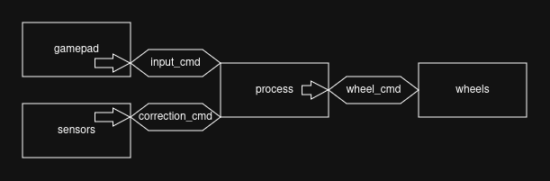

# Level 3: Package Infrastructure and Multiple Nodes

Welcome to Level 3! In this level, you'll take what you accomplished in the previous level and extend it to create a ROS package that controls a virtual rover, integrating rover drift correction using sensors.

## Objectives

- Extend your package to multiple publishers and subscribers
- Experience a bit merging data from different topics

## Scenario: Controlling the Rover



In addition to what you did in level 2, you will now have to work with the following:
- `TrajectoryPublisher` should now be called `GamepadNode`, and should publish `Twist` messages to the `input_cmd` topic;
- The new `SensorNode` will publish `Twist` messages to the `correction_cmd` topic, modeling the correction your rover should apply, provided by imaginary sensors;
- The new `ProcessNode` will listen on both the `input_cmd` and `correction_cmd` topics, and publish the resulting `Twist`  representing the real position of the rover to `gps_pos`;
- The new `GPSNode` will listen on the `gps_pos` topic, and print the resulting position to the screen.

> [!NOTE]
>
> The `ProcessNode` calculation should work the following way:
>
> - Keep a local `Twist` of the current position.
> - Whenever you get a `Twist` from `input_cmd` or `correction_cmd`, add it to the current position.
> - Publish the current position to `gps_pos` every second.


## Step-by-Step Instructions

This level will be way less guided than the previous ones.

Here are the base codes for some files:

> `rover_commands/src/gamepad.cpp`

The `publisher.cpp` code from level 2, renaming needed things :)

> `rover_commands/src/sensor.cpp`

```cpp
#include <chrono>
#include <cmath>
#include <memory>

#include "rclcpp/rclcpp.hpp"
#include "geometry_msgs/msg/twist.hpp"

class SensorNode : public rclcpp::Node {
public:
    SensorNode() : Node("sensor_node") {

		// TODO: Create a publisher of type Twist
		// Your code here...
		
		// TODO: Make the `publish_correction` be called every second
		// Your code here...

		start_time_ = this->now();

        RCLCPP_INFO(this->get_logger(), "Sensor node has been started");
    }

private:
    void publish_correction() {
        double t = (this->now() - start_time_).seconds();

        geometry_msgs::msg::Twist msg;

        msg.linear.x = std::sin(t);
        msg.linear.z = std::cos(t);
        msg.angular.y = t;

		// TODO: Publish `msg` to the `correction_cmd` topic
		// Your code here...

        RCLCPP_INFO(
            this->get_logger(),
            "Published correction: x=%.3f, z=%.3f, ry=%.3f",
            msg.linear.x,
            msg.linear.z,
            msg.angular.y
        );
    }

private:
    rclcpp::Time start_time_;
};

int main(int argc, char* argv[]) {
    rclcpp::init(argc, argv);
    rclcpp::spin(std::make_shared<SensorNode>());
    rclcpp::shutdown();
    return 0;
}
```

> `rover_commands/src/process.cpp`

```cpp
#include <memory>

#include "rclcpp/rclcpp.hpp"
#include "geometry_msgs/msg/twist.hpp"

class ProcessNode : public rclcpp::Node {
public:
    ProcessNode() : Node("process_node") {

		// TODO: Create a subscriber on the `input_cmd` topic
		// Your code here...
		
		// TODO: Create a subscriber on the `correction_cmd` topic
		// Your code here...

		// TODO: Create a publisher of type Twist on the `gps_pos` topic
		// Your code here...
		
        RCLCPP_INFO(this->get_logger(), "Process node has been started");
    }

private:
	// TODO: Add private functions here (callbacks?)

private:
	// TODO: Add private members here (publishers/subscribers instances?)
};

int main(int argc, char* argv[]) {
    rclcpp::init(argc, argv);
    rclcpp::spin(std::make_shared<ProcessNode>());
    rclcpp::shutdown();
    return 0;
}
```

> `rover_commands/src/gps.cpp`

```cpp
#include <memory>

#include "rclcpp/rclcpp.hpp"
#include "geometry_msgs/msg/twist.hpp"

class GPSNode : public rclcpp::Node {
public:
    GPSNode() : Node("gps_node") {

		// TODO: Create a subscriber on the `gps_pos` topic
		// Your code here...

        RCLCPP_INFO(this->get_logger(), "GPS node has been started");
    }

private:
	// TODO: Add private functions here (callbacks?)

private:
	// TODO: Add private members here (subscriber instance?)
};

int main(int argc, char* argv[]) {
    rclcpp::init(argc, argv);
    rclcpp::spin(std::make_shared<GPSNode>());
    rclcpp::shutdown();
    return 0;
}
```

Now, good luck, and don't forget, the [ROS documentation](https://docs.ros.org/en/humble/index.html) is your friend, and you can always ask questions.
